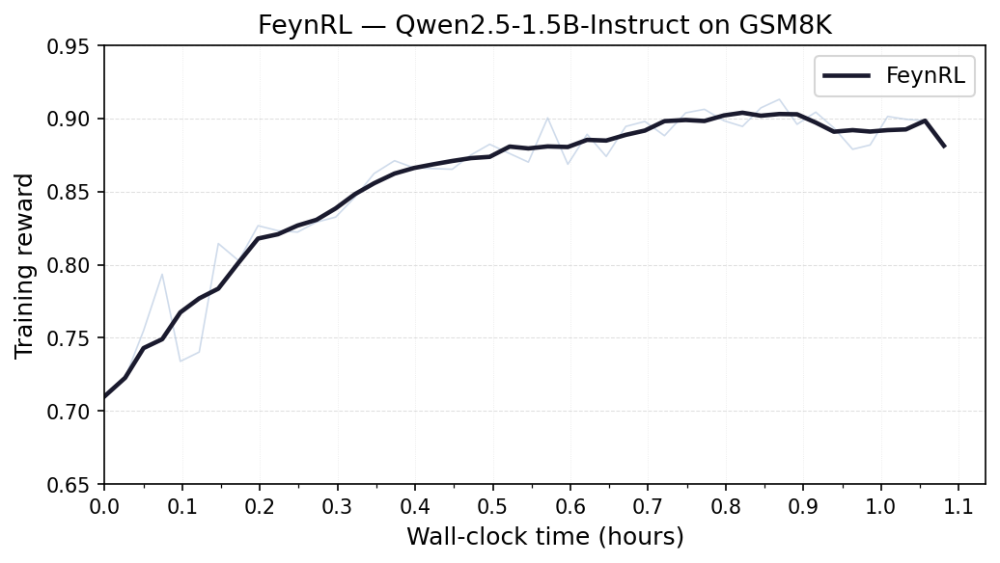
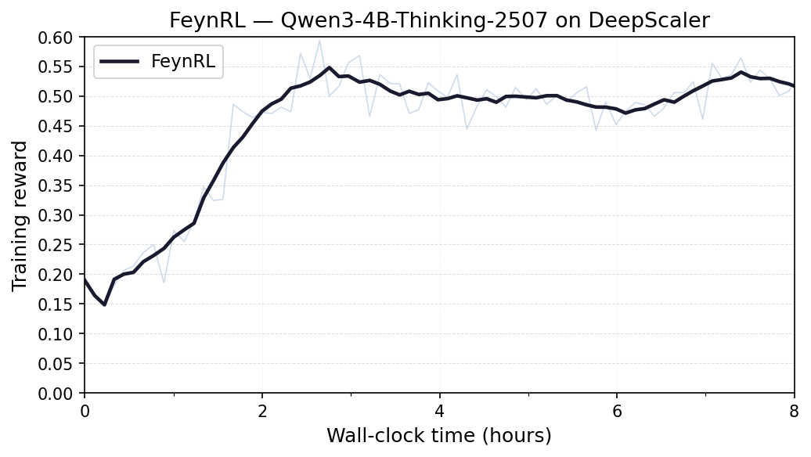

# FeynRL — Results

This document presents training and evaluation results for FeynRL on mathematical reasoning tasks, with full reproducibility information.

## Shared Setup

The experiments below share the same high-level training and evaluation setup:

- **Algorithm:** GRPO
- **Hardware:** 4 training GPUs + 4 rollout GPUs
- **DeepSpeed:** ZeRO stage 3, bf16
- **Training reproduction:** `python main_rl.py --config examples/<experiment>/train.yaml`
- **Evaluation reproduction:** `python main_eval.py --config examples/<experiment>/eval/eval_<benchmark>.yaml`

### Shared Evaluation Protocol

Unless noted otherwise, downstream evaluation:

- covers 10 mathematical reasoning benchmarks
- reports pass@1 and pass@16
- uses `n=16` samples per prompt
- uses temperature `1.0`

Each experiment stores evaluation configs in its own `examples/<experiment>/eval/` directory, using the same benchmark-specific filenames listed below.

| File                      | Benchmark     | Dataset                                                                                |
| ------------------------- | ------------- | -------------------------------------------------------------------------------------- |
| `eval/eval_gsm8k.yaml`    | GSM8K         | [openai/gsm8k](https://huggingface.co/datasets/openai/gsm8k)                           |
| `eval/eval_aime2024.yaml` | AIME 2024     | [HuggingFaceH4/aime_2024](https://huggingface.co/datasets/HuggingFaceH4/aime_2024)     |
| `eval/eval_aime2025.yaml` | AIME 2025     | [MathArena/aime_2025](https://huggingface.co/datasets/MathArena/aime_2025)             |
| `eval/eval_aime2026.yaml` | AIME 2026     | [MathArena/aime_2026](https://huggingface.co/datasets/MathArena/aime_2026)             |
| `eval/eval_amc.yaml`      | AMC           | [AI-MO/aimo-validation-amc](https://huggingface.co/datasets/AI-MO/aimo-validation-amc) |
| `eval/eval_amo.yaml`      | AMO           | [meituan-longcat/AMO-Bench](https://huggingface.co/datasets/meituan-longcat/AMO-Bench) |
| `eval/eval_brumo.yaml`    | Brumo         | [MathArena/brumo_2025](https://huggingface.co/datasets/MathArena/brumo_2025)           |
| `eval/eval_hmmt_feb.yaml` | HMMT February | [MathArena/hmmt_feb_2025](https://huggingface.co/datasets/MathArena/hmmt_feb_2025)     |
| `eval/eval_hmmt_nov.yaml` | HMMT November | [MathArena/hmmt_nov_2025](https://huggingface.co/datasets/MathArena/hmmt_nov_2025)     |
| `eval/eval_olympiad.yaml` | Olympiad      | [Hothan/OlympiadBench](https://huggingface.co/datasets/Hothan/OlympiadBench)           |

---

## Qwen2.5-1.5B-Instruct

### Training

**Model:** `Qwen/Qwen2.5-1.5B-Instruct`  
**Dataset:** GSM8K

The reward curve below shows `rollout/avg_reward` over wall-clock time during training.



Training reaches **0.894** reward at the 1-hour mark and continues improving, plateauing near **0.91** by the end of the run.

**Config:** [`examples/qwen2.5-1.5b-instruct/train.yaml`](examples/qwen2.5-1.5b-instruct/train.yaml)

To reproduce training:

```bash
python main_rl.py --config examples/qwen2.5-1.5b-instruct/train.yaml
```

### Downstream Evaluation

The trained checkpoint was evaluated using the shared protocol above.

**pass@1**

|        | AIME 24 | AIME 25 | AIME 26 |   AMC |  AMO | Brumo | GSM8K | HMMT-F | HMMT-N | Olympiad |   **Avg** |
| ------ | ------: | ------: | ------: | ----: | ---: | ----: | ----: | -----: | -----: | -------: | --------: |
| Base   |    1.7% |    0.4% |    0.6% | 10.7% | 0.6% |  7.1% | 85.9% |   0.4% |   2.1% |    10.8% | **12.0%** |
| FeynRL |    2.1% |    2.5% |    0.8% | 10.0% | 1.0% |  5.0% | 70.7% |   0.0% |   2.7% |    18.4% | **12.2%** |

**pass@16**

|        | AIME 24 | AIME 25 | AIME 26 |   AMC |   AMO | Brumo | GSM8K | HMMT-F | HMMT-N | Olympiad |   **Avg** |
| ------ | ------: | ------: | ------: | ----: | ----: | ----: | ----: | -----: | -----: | -------: | --------: |
| Base   |   16.7% |    6.7% |   10.0% | 46.7% |  8.0% | 23.3% | 96.2% |   6.7% |  16.7% |    33.3% | **26.4%** |
| FeynRL |   13.3% |   20.0% |    6.7% | 42.2% | 10.0% | 26.7% | 92.9% |   0.0% |  10.0% |    48.1% | **27.0%** |

### Reproducing Evaluation

Evaluation configs are in [`examples/qwen2.5-1.5b-instruct/eval/`](examples/qwen2.5-1.5b-instruct/eval/).

```bash
python main_eval.py --config examples/qwen2.5-1.5b-instruct/eval/eval_gsm8k.yaml
python main_eval.py --config examples/qwen2.5-1.5b-instruct/eval/eval_aime2025.yaml
```

### Key Hyperparameters

| Parameter              | Value                                                 |
| ---------------------- | ----------------------------------------------------- |
| Model                  | Qwen/Qwen2.5-1.5B-Instruct                            |
| Dataset                | [GSM8K](https://huggingface.co/datasets/openai/gsm8k) |
| Learning rate          | 1e-5                                                  |
| LR scheduler           | WarmupCosineLR (10% warmup)                           |
| KL coefficient         | 0.0                                                   |
| Clip (low / high)      | 0.4 / 0.4                                             |
| Training batch per GPU | 4                                                     |
| Gradient accumulation  | 8                                                     |
| Rollout n_samples      | 4                                                     |
| Rollout max_tokens     | 1024                                                  |
| Rollout samples/epoch  | 512                                                   |
| Max seq length         | 1024                                                  |
| Total epochs           | 500                                                   |

---

## Qwen3-4B-Thinking-2507

### Training

**Model:** `Qwen/Qwen3-4B-Thinking-2507`  
**Dataset:** DeepScaler

The reward curve below shows `rollout/avg_reward` over wall-clock time during training (~8 hours).



**Config:** [`examples/qwen3-4b-thinking-2507/train.yaml`](examples/qwen3-4b-thinking-2507/train.yaml)

To reproduce training:

```bash
python main_rl.py --config examples/qwen3-4b-thinking-2507/train.yaml
```

### Downstream Evaluation

The trained checkpoint (`iter000075`) was evaluated using the shared protocol above. Datasets use the with-system-prompt (`wsp`) variant to match the model's instruction format.

**pass@1**

|        | AIME 24 | AIME 25 | AIME 26 |   AMC |  AMO | Brumo | GSM8K | HMMT-F | HMMT-N | Olympiad |   **Avg** |
| ------ | ------: | ------: | ------: | ----: | ---: | ----: | ----: | -----: | -----: | -------: | --------: |
| Base   |    1.0% |    2.1% |    0.0% |     — | 0.6% |  3.1% | 88.5% |   0.8% |   0.2% |    13.4% | **12.2%** |
| FeynRL |   13.5% |   25.0% |   12.7% | 43.6% | 1.1% | 21.3% | 93.9% |   6.9% |   6.9% |    44.9% | **27.0%** |

**pass@16**

|        | AIME 24 | AIME 25 | AIME 26 |   AMC |  AMO | Brumo | GSM8K | HMMT-F | HMMT-N | Olympiad |   **Avg** |
| ------ | ------: | ------: | ------: | ----: | ---: | ----: | ----: | -----: | -----: | -------: | --------: |
| Base   |    6.7% |    6.7% |    0.0% |     — | 2.0% | 16.7% | 96.4% |  10.0% |   3.3% |    35.2% | **19.7%** |
| FeynRL |   33.3% |   33.3% |   16.7% | 71.1% | 6.0% | 40.0% | 97.3% |  20.0% |  20.0% |    64.2% | **40.2%** |

FeynRL improves average pass@1 by **+12.9 pp** and pass@16 by **+17.1 pp** over the base model.

### Reproducing Evaluation

Evaluation configs are in [`examples/qwen3-4b-thinking-2507/eval/`](examples/qwen3-4b-thinking-2507/eval/).

```bash
python main_eval.py --config examples/qwen3-4b-thinking-2507/eval/eval_gsm8k.yaml
python main_eval.py --config examples/qwen3-4b-thinking-2507/eval/eval_aime2025.yaml
```

### Key Hyperparameters

| Parameter              | Value                                                                                 |
| ---------------------- | ------------------------------------------------------------------------------------- |
| Model                  | Qwen/Qwen3-4B-Thinking-2507                                                           |
| Dataset                | [DeepScaler](https://huggingface.co/datasets/agentica-org/DeepScaleR-Preview-Dataset) |
| Learning rate          | 1e-6                                                                                  |
| LR scheduler           | WarmupCosineLR (10% warmup)                                                           |
| KL coefficient         | 0.001                                                                                 |
| Clip (low / high)      | 0.2 / 0.2                                                                             |
| Training batch per GPU | 8                                                                                     |
| Gradient accumulation  | 4                                                                                     |
| Rollout n_samples      | 8                                                                                     |
| Rollout max_tokens     | 2048                                                                                  |
| Rollout samples/epoch  | 256                                                                                   |
| Max seq length         | 4069                                                                                  |
| Total epochs           | 100                                                                                   |
| Steps per epoch        | 4                                                                                     |
