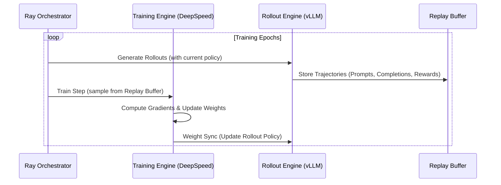

# FeynRL Architecture Overview

FeynRL is designed with a **separation of concerns** between algorithmic logic and system-level orchestration. This modularity allows researchers to focus on developing new methods while leveraging a scalable, high-performance training stack.

## 📂 Repository Structure

```text
FeynRL/
├── algs/               # Implementation of RL/SL algorithms (PPO, SGRPO, DPO, SFT, etc.)
├── configs/            # YAML configuration files and Pydantic schema validation
├── data_feeds/         # Data loading, sampling, and replay buffer handling
├── data_prep/          # Scripts for processing raw datasets (GSM8K, HH-RLHF)
├── docs/               # Documentation files (Installation, FAQ, Architecture)
├── rewards/            # Reward functions for RL training
├── rollouts/           # vLLM-powered rollout engine and weight synchronization
├── tests/              # Unit and integration tests
├── scripts/            # Helper scripts for local and cluster (Slurm) execution
├── main_rl.py          # Entry point for Reinforcement Learning training
├── main_sl.py          # Entry point for Supervised Fine-Tuning (SFT)
├── main_cl.py          # Entry point for Contrastive Learning (e.g., DPO)
├── main_eval.py        # Entry point for standalone model evaluation
├── requirements.txt    # Project dependencies
└── README.md           # Main project landing page
```


## System Components

### 🛰️ Orchestration (Ray)
Ray serves as the central orchestrator, managing the lifecycle of distributed workers across a cluster. It schedules:
- **Training Workers**: Handle model optimization using DeepSpeed.
- **Rollout Workers**: Generate trajectories using vLLM rollout engines.

### 🖥️ Training Engine (DeepSpeed)
The training engine utilizes **DeepSpeed** for distributed training, supporting:
- **ZeRO Stage 1/2/3**: Efficient parameter, gradient, and optimizer state partitioning.
- **CPU Offloading**: Optional offloading of optimizer states and parameters to CPU memory to handle larger models.
- **LoRA Support**: Parameter-efficient fine-tuning via PEFT integration.

### 🎲 Rollout Engine (vLLM)
Trajectory generation is powered by **vLLM**, which provides:
- **High Throughput Generation**: Optimized kernels and PagedAttention for fast inference.
- **Tensor Parallelism**: Capability to shard large models across multiple GPUs for rollout.
- **Dynamic Loading**: Support for updating policy weights during training.

## Data Flow & Synchronization

The following diagram illustrates the interaction between the core components during a typical RL training loop:



### Weight Synchronization
FeynRL supports two methods for syncing weights from the training engine to the rollout workers:
1. **Direct Sync**: Weights are pushed directly via GPU/system memory, minimizing disk I/O and latency.
2. **Disk Sync**: Weights are saved to a checkpoint on disk, and rollout workers reload them. This is more robust in certain multi-node environments.

## Modularity & Extensibility

- **Algorithm Agnostic**: The system is designed to support various algorithms (PPO, GRPO, DPO, SFT) by providing a common interface for data handling and model updates.
- **Pluggable Rewards**: Custom reward functions can be easily integrated by adding them to the `rewards/` module and referencing them in the configuration.
- **Flexible Data Processing**: The data pipeline supports mixed-dataset sampling with configurable ratios, allowing for complex training recipes.
