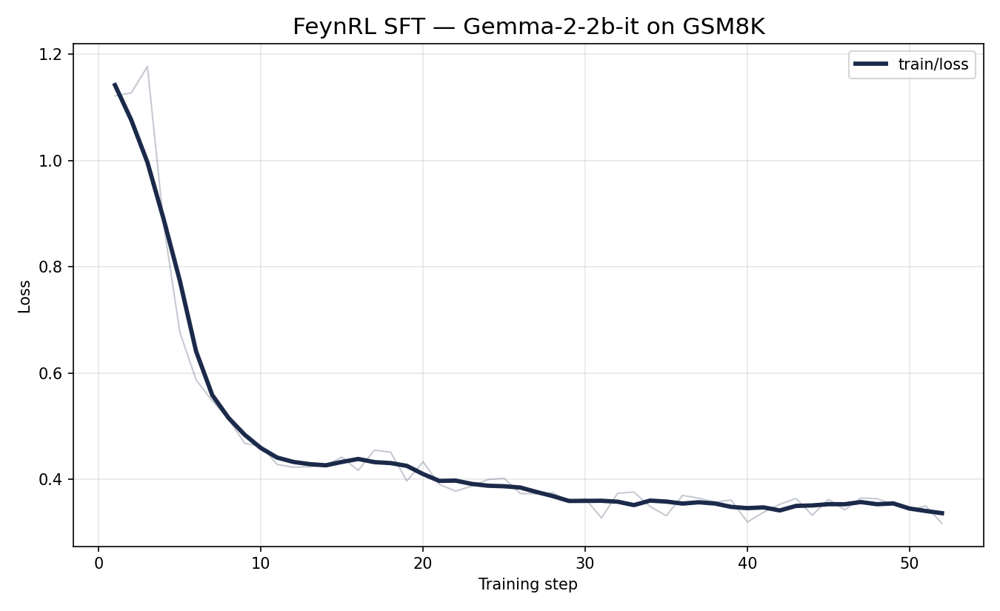
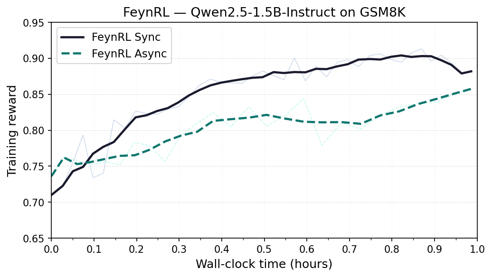
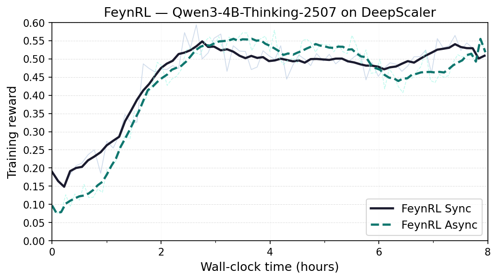

# LLM Experiments

Text-only language model experiments using FeynRL's SFT and RL (GRPO) pipelines on mathematical reasoning datasets.

## Directory Layout

```text
llm/
├── sft/
│   └── gsm8k/
│       └── gemma-2-2b-it/              # SFT on GSM8K with Gemma-2-2B-it
├── rl/
│   └── gsm8k/
│       ├── qwen2.5-1.5b-instruct/      # GRPO on GSM8K with Qwen2.5-1.5B-Instruct
│       └── qwen3-4b-thinking-2507/     # GRPO on DeepScaler with Qwen3-4B-Thinking-2507
└── README.md
```

---

## Gemma-2-2B-it — GSM8K (SFT)

| Item              | Value                                                                                   |
| ------------------ | ---------------------------------------------------------------------------------------- |
| Model              | `google/gemma-2-2b-it`                                                                  |
| Training dataset   | [GSM8K](https://huggingface.co/datasets/openai/gsm8k)                                  |
| Algorithm          | SFT (supervised fine-tuning)                                                             |
| DeepSpeed          | ZeRO stage 3, bf16                                                                       |
| Training config    | [`sft/gsm8k/gemma-2-2b-it/train.yaml`](sft/gsm8k/gemma-2-2b-it/train.yaml)             |
| Evaluation config  | [`sft/gsm8k/gemma-2-2b-it/eval.yaml`](sft/gsm8k/gemma-2-2b-it/eval.yaml)               |

### Data Preparation

```bash
python data_prep/gsm8k.py --local_dir ./data --system_prompt ""
```

The script writes `gsm8k_processed_{run_id}_ns_train.parquet`, `..._val.parquet`, and `..._test.parquet` under `./data/`. Update `data.train_files_path`, `data.val_files_path` (training config), and `data.test_files_path` (evaluation config) to match.

### Training

```bash
CUDA_VISIBLE_DEVICES=0,1,2,3,4,5,6,7 torchrun --nproc_per_node=8 main_sft.py --config examples/llm/sft/gsm8k/gemma-2-2b-it/train.yaml
```



### Evaluation Results

Evaluated on the GSM8K test set with `n_samples=8`, temperature `1.0`.

| Model  | GSM8K pass@1 |
| ------ | -----------: |
| Base   |       21.81% |
| FeynRL |   **32.59%** |

SFT improves pass@1 by **+10.78 pp** over the base model.

### Key Training Settings

| Parameter             | Value                       |
| ---------------------- | --------------------------- |
| Model                  | google/gemma-2-2b-it        |
| Dataset                | GSM8K                       |
| Learning rate          | 1e-5                        |
| LR scheduler           | WarmupCosineLR (10% warmup) |
| Train batch per GPU    | 1                           |
| Gradient accumulation  | 16                          |
| Micro batches / epoch  | 416                         |
| Max sequence length    | 4096                        |
| DeepSpeed              | ZeRO stage 3, bf16          |
| LoRA                   | disabled (full fine-tune)   |
| Total epochs           | 2                           |

### Reproducing Evaluation

```bash
CUDA_VISIBLE_DEVICES=0,1,2,3,4,5,6,7 python main_eval.py --config examples/llm/sft/gsm8k/gemma-2-2b-it/eval.yaml
```

Replace `model.name` with your checkpoint path and `data.test_files_path` with your target benchmark parquet.

---

## RL Shared Setup

The following applies to the RL (GRPO) experiments below.

- **Algorithm:** GRPO
- **DeepSpeed:** ZeRO stage 2/3, bf16
- **Hardware:** 8×H100 GPUs with CUDA v12.4
- **Training:** `CUDA_VISIBLE_DEVICES=0,1,2,3,4,5,6,7 python main_rl.py --config examples/llm/rl/<dataset>/<model>/train_sync.yaml`
- **Evaluation:** `CUDA_VISIBLE_DEVICES=0,1,2,3,4,5,6,7 python main_eval.py --config examples/llm/rl/<dataset>/<model>/eval.yaml`

### Shared Evaluation Protocol

Downstream evaluation reports pass@1 and pass@16 across 10 mathematical reasoning benchmarks using `n=16` samples per prompt and temperature `1.0`.

| Benchmark     | Dataset Card                                                                           | Benchmark     | Dataset Card                                                                           |
| ------------- | -------------------------------------------------------------------------------------- | ------------- | -------------------------------------------------------------------------------------- |
| GSM8K         | [openai/gsm8k](https://huggingface.co/datasets/openai/gsm8k)                           | AIME 2024     | [HuggingFaceH4/aime_2024](https://huggingface.co/datasets/HuggingFaceH4/aime_2024)     |
| AIME 2025     | [MathArena/aime_2025](https://huggingface.co/datasets/MathArena/aime_2025)             | AIME 2026     | [MathArena/aime_2026](https://huggingface.co/datasets/MathArena/aime_2026)             |
| AMC           | [AI-MO/aimo-validation-amc](https://huggingface.co/datasets/AI-MO/aimo-validation-amc) | AMO           | [meituan-longcat/AMO-Bench](https://huggingface.co/datasets/meituan-longcat/AMO-Bench) |
| Brumo         | [MathArena/brumo_2025](https://huggingface.co/datasets/MathArena/brumo_2025)           | HMMT February | [MathArena/hmmt_feb_2025](https://huggingface.co/datasets/MathArena/hmmt_feb_2025)     |
| HMMT November | [MathArena/hmmt_nov_2025](https://huggingface.co/datasets/MathArena/hmmt_nov_2025)     | Olympiad      | [Hothan/OlympiadBench](https://huggingface.co/datasets/Hothan/OlympiadBench)           |

---

## Qwen2.5-1.5B-Instruct — GSM8K

| Item                  | Value                                                                                                  |
| --------------------- | ------------------------------------------------------------------------------------------------------ |
| Model                 | `Qwen/Qwen2.5-1.5B-Instruct`                                                                          |
| Training dataset      | [GSM8K](https://huggingface.co/datasets/openai/gsm8k)                                                 |
| GPU split             | 6 training GPUs / 2 rollout GPUs                                                                       |
| Sync training config  | [`rl/gsm8k/qwen2.5-1.5b-instruct/train_sync.yaml`](rl/gsm8k/qwen2.5-1.5b-instruct/train_sync.yaml)   |
| Async training config | [`rl/gsm8k/qwen2.5-1.5b-instruct/train_async.yaml`](rl/gsm8k/qwen2.5-1.5b-instruct/train_async.yaml) |
| Evaluation config     | [`rl/gsm8k/qwen2.5-1.5b-instruct/eval.yaml`](rl/gsm8k/qwen2.5-1.5b-instruct/eval.yaml)               |

### Data Preparation

```bash
python data_prep/gsm8k.py --local_dir ./data --system_prompt ""
```

The script writes `gsm8k_processed_{run_id}_ns_train.parquet` and `gsm8k_processed_{run_id}_ns_val.parquet` under `./data/`. Update `data.train_files_path` and `data.val_files_path` in the training config to match.

### Training

```bash
# Synchronous (no overlap)
CUDA_VISIBLE_DEVICES=0,1,2,3,4,5,6,7 python main_rl.py --config examples/llm/rl/gsm8k/qwen2.5-1.5b-instruct/train_sync.yaml

# Asynchronous (with overlap)
CUDA_VISIBLE_DEVICES=0,1,2,3,4,5,6,7 python main_rl.py --config examples/llm/rl/gsm8k/qwen2.5-1.5b-instruct/train_async.yaml
```

The reward curves below overlay the sync and async runs over the first hour of wall-clock training time.



At 1 hour, the sync run reaches **0.894** reward and the async run reaches **0.858**.

### Evaluation Results

| Model  | Avg pass@1 | Avg pass@16 |
| ------ | ---------: | ----------: |
| Base   |      12.0% |       26.4% |
| FeynRL |      12.2% |       27.0% |

### Key Training Settings

| Parameter              | Value                                                        |
| ---------------------- | ------------------------------------------------------------ |
| Model                  | Qwen/Qwen2.5-1.5B-Instruct                                   |
| Dataset                | GSM8K                                                        |
| GPU split              | 6 training / 2 rollout                                       |
| Weight sync            | direct                                                       |
| Overlap                | disabled in `train_sync.yaml`, enabled in `train_async.yaml` |
| Learning rate          | 1e-5                                                         |
| LR scheduler           | WarmupCosineLR (10% warmup)                                  |
| KL coefficient         | 0.0                                                          |
| Clip (low / high)      | 0.4 / 0.4                                                    |
| Train batch per GPU    | 8                                                            |
| Gradient accumulation  | 1                                                            |
| Rollout samples/prompt | 4                                                            |
| Rollout samples/epoch  | 512                                                          |
| Rollout max tokens     | 1024                                                         |
| Context length         | 1024                                                         |
| Total epochs           | 100                                                          |

---

## Qwen3-4B-Thinking-2507 — DeepScaler

| Item                    | Value                                                                                                      |
| ----------------------- | ---------------------------------------------------------------------------------------------------------- |
| Model                   | `Qwen/Qwen3-4B-Thinking-2507`                                                                              |
| Training dataset        | [DeepScaler](https://huggingface.co/datasets/agentica-org/DeepScaleR-Preview-Dataset)                      |
| GPU split               | 4 training GPUs / 4 rollout GPUs                                                                           |
| Sync training config    | [`rl/gsm8k/qwen3-4b-thinking-2507/train_sync.yaml`](rl/gsm8k/qwen3-4b-thinking-2507/train_sync.yaml)     |
| Async training config   | [`rl/gsm8k/qwen3-4b-thinking-2507/train_async.yaml`](rl/gsm8k/qwen3-4b-thinking-2507/train_async.yaml)   |
| Evaluation config       | [`rl/gsm8k/qwen3-4b-thinking-2507/eval.yaml`](rl/gsm8k/qwen3-4b-thinking-2507/eval.yaml)                 |

### Training

```bash
# Synchronous (no overlap)
CUDA_VISIBLE_DEVICES=0,1,2,3,4,5,6,7 python main_rl.py --config examples/llm/rl/gsm8k/qwen3-4b-thinking-2507/train_sync.yaml

# Asynchronous (with overlap)
CUDA_VISIBLE_DEVICES=0,1,2,3,4,5,6,7 python main_rl.py --config examples/llm/rl/gsm8k/qwen3-4b-thinking-2507/train_async.yaml
```

The reward curves below overlay the sync and async runs over the first 8 hours of wall-clock training time.



At 8 hours, the sync run is at **0.526** reward and the async run is at **0.584**.

### Evaluation Results

The trained checkpoint (`iter000075`) was evaluated using the shared protocol (with-system-prompt variant):

| Model  | Avg pass@1 | Avg pass@16 |
| ------ | ---------: | ----------: |
| Base   |      12.2% |       19.7% |
| FeynRL |      27.0% |       40.2% |

FeynRL improves average pass@1 by **+12.9 pp** and pass@16 by **+17.1 pp** over the base model.

### Key Training Settings

| Parameter              | Value                                                                                 |
| ---------------------- | ------------------------------------------------------------------------------------- |
| Model                  | Qwen/Qwen3-4B-Thinking-2507                                                           |
| Dataset                | DeepScaler                                                                            |
| GPU split              | 4 training / 4 rollout                                                                |
| Weight sync            | direct (sync) / NCCL (async)                                                          |
| Overlap                | disabled in `train_sync.yaml`, enabled in `train_async.yaml`                          |
| Learning rate          | 1e-5 (comparison) / 1e-6 (primary)                                                    |
| LR scheduler           | WarmupCosineLR (10% warmup)                                                           |
| KL coefficient         | 0.0 (comparison) / 0.001 (primary)                                                    |
| Clip (low / high)      | 0.4 / 0.4 (comparison) / 0.2 / 0.2 (primary)                                         |
| Train batch per GPU    | 4 (comparison) / 8 (primary)                                                          |
| Gradient accumulation  | 2 (comparison) / 4 (primary)                                                          |
| Rollout samples/prompt | 4 (comparison) / 8 (primary)                                                          |
| Rollout samples/epoch  | 256                                                                                   |
| Rollout max tokens     | 2048                                                                                  |
| Context length         | 4096                                                                                  |
| Total epochs           | 500 (comparison) / 100 (primary)                                                      |
