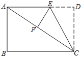
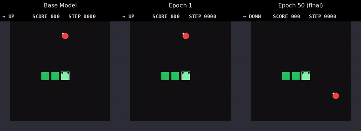

# VLM Experiments

Visual Language Model (VLM) experiments fine-tune multimodal models on image+text datasets using FeynRL's SFT and RL pipelines.

## Directory Layout

```text
vlm/
├── sft/
│   ├── mm_math/
│   │   └── qwen2.5-vl-3b-instruct/        # SFT on MM-Math with Qwen2.5-VL-3B-Instruct
│   └── snake/
│       ├── snake.py                        # Snake environment and BFS oracle
│       ├── prepare_data.py                 # Oracle-imitation dataset generator
│       └── smolvlm2-500m-video-instruct/  # Snake game SFT with SmolVLM2-500M-Video-Instruct
├── rl/
│   └── mm_math/
│       └── qwen2.5-vl-3b-instruct/        # GRPO on MM-Math with Qwen2.5-VL-3B-Instruct
└── README.md
```

---

## MM-Math: Qwen2.5-VL-3B-Instruct

Both experiments below use the same model and dataset; SFT runs supervised fine-tuning while RL runs GRPO with a math-verification reward signal.

### Dataset

[MM-Math](https://huggingface.co/datasets/THU-KEG/MM_Math) is a multimodal math reasoning dataset. Each row contains an image alongside a math problem and worked solution.

Prepare the train/val/test parquet files with:

```bash
python data_prep/mm_math.py --local_dir ./data/mm_math
```

This produces:
- `./data/mm_math/mm_math_train.parquet`
- `./data/mm_math/mm_math_val.parquet`
- `./data/mm_math/mm_math_test.parquet`

Update `data.train_files_path` / `data.val_files_path` / `data.test_files_path` in the configs if you place them elsewhere.

For other supported eval benchmarks ([Geometry3K](https://huggingface.co/datasets/hiyouga/geometry3k), [MathVista](https://huggingface.co/datasets/AI4Math/MathVista)), prepare the corresponding test parquets and swap `data.test_files_path` accordingly.

### Sample Processed Row

The parquet rows look like a compact Hugging Face dataset card entry: one image, one chat-style prompt, the full worked solution for SFT, and a short extracted answer for evaluation.

| Field | Sample value |
| ----- | ------------ |
| `image` |  |
| `question` | `As shown in the figure, fold the rectangular paper ABCD so that edge DC falls on the diagonal line AC, with the fold line being CE, and point D falling on point F on the diagonal line. If AB=6 and AD=8, what is the length of ED?` |
| `prompt` | <pre><code>[{"role": "system", "content": "You are a helpful assistant. Solve the math problem shown in the image."}, {"role": "user", "content": "As shown in the figure, fold the rectangular paper ABCD so that edge DC falls on the diagonal line AC, with the fold line being CE, and point D falling on point F on the diagonal line. If AB=6 and AD=8, what is the length of ED?"}]</code></pre> |
| `answer` | <pre><code>Solution: In rectangle $ABCD$, $AB=6$, $AD=8$, \\ \n$\\therefore$ $DC=6$, \\ \n$\\therefore$ $AC=\\sqrt{AD^{2}+DC^{2}}=10$, \\ \nFrom the folding, it follows that $\\triangle DEC \\cong \\triangle FEC$, \\ \n$\\therefore$ $FC=DC=6$, $DE=FE$, \\ \nLet $ED=x$, then $FE=x$, $AF=AC−CF=4$, $AE=8−x$, \\ \nIn $\\triangle AEF$: $AF^{2}+EF^{2}=AE^{2}$, \\ \n$4^{2}+x^{2}=(8−x)^{2}$, \\ \nSolving this yields: $x=\\boxed{3}$.</code></pre> |
| `solution` | `3` |
| `image_bytes` | PNG-encoded bytes for the image above |
| `year` | `eight` |
| `difficult` | `medium` |
| `knowledge` | `{"level_1": "Transformations of Shapes", "level_2": "Symmetry of Shapes"}` |
| `split` | `train` |
| `index` | `0` |

---

## SFT

| Item              | Value                                                                                   |
| ----------------- | --------------------------------------------------------------------------------------- |
| Model             | `Qwen/Qwen2.5-VL-3B-Instruct`                                                          |
| Dataset           | MM-Math                                                                                 |
| Algorithm         | SFT (supervised fine-tuning)                                                            |
| Hardware          | 8×H100 GPUs                                                                             |
| Training config   | [`sft/mm_math/qwen2.5-vl-3b-instruct/train.yaml`](sft/mm_math/qwen2.5-vl-3b-instruct/train.yaml) |
| Evaluation config | [`sft/mm_math/qwen2.5-vl-3b-instruct/eval.yaml`](sft/mm_math/qwen2.5-vl-3b-instruct/eval.yaml)   |

### Training

```bash
CUDA_VISIBLE_DEVICES=0,1,2,3,4,5,6,7 torchrun --nproc_per_node=8 main_sft.py --config examples/vlm/sft/mm_math/qwen2.5-vl-3b-instruct/train.yaml
```

### Key Training Settings

| Parameter               | Value                          |
| ----------------------- | ------------------------------ |
| Model                   | Qwen/Qwen2.5-VL-3B-Instruct    |
| Epochs                  | 5                              |
| Learning rate           | 1e-5                           |
| LR scheduler            | WarmupCosineLR (5% warmup)     |
| Train batch per GPU     | 2                              |
| Gradient accumulation   | 2 (effective batch = 32)       |
| Max sequence length     | 4096                           |
| Max image pixels        | 401 408                        |
| DeepSpeed               | ZeRO stage 2, bf16             |
| LoRA                    | disabled (full fine-tune)      |

### Evaluation Results

Evaluated on MM-Math test, Geometry3K, and MathVista using greedy decoding (temperature=0, n=1).

| Model                              | MM-Math | Geometry3K | MathVista |
| ---------------------------------- | ------: | ---------: | --------: |
| Qwen2.5-VL-3B-Instruct (base)      |   23.0% |      28.5% |     52.0% |
| + SFT on MM-Math                   |   18.0% |      27.5% |     60.6% |

### Reproducing Evaluation

```bash
CUDA_VISIBLE_DEVICES=0,1,2,3,4,5,6,7 python main_eval.py --config examples/vlm/sft/mm_math/qwen2.5-vl-3b-instruct/eval.yaml
```

Replace `model.name` with your checkpoint path and `data.test_files_path` with your target benchmark parquet.

---

## RL (GRPO)

| Item              | Value                                                                                     |
| ----------------- | ----------------------------------------------------------------------------------------- |
| Model             | `Qwen/Qwen2.5-VL-3B-Instruct`                                                            |
| Dataset           | MM-Math                                                                                   |
| Algorithm         | GRPO                                                                                      |
| Reward function   | `math_verify_reward_func`                                                                 |
| GPU split         | 6 training GPUs / 2 rollout GPUs                                                          |
| Training config   | [`rl/mm_math/qwen2.5-vl-3b-instruct/train.yaml`](rl/mm_math/qwen2.5-vl-3b-instruct/train.yaml) |
| Evaluation config | [`rl/mm_math/qwen2.5-vl-3b-instruct/eval.yaml`](rl/mm_math/qwen2.5-vl-3b-instruct/eval.yaml)   |

### Training

```bash
CUDA_VISIBLE_DEVICES=0,1,2,3,4,5,6,7 python main_rl.py --config examples/vlm/rl/mm_math/qwen2.5-vl-3b-instruct/train.yaml
```

### Key Training Settings

| Parameter               | Value                          |
| ----------------------- | ------------------------------ |
| Model                   | Qwen/Qwen2.5-VL-3B-Instruct    |
| Epochs                  | 50                             |
| Steps per epoch         | 1                              |
| Learning rate           | 5e-6                           |
| LR scheduler            | WarmupCosineLR (5% warmup)     |
| KL coefficient          | 0.0                            |
| Clip (low / high)       | 0.2 / 0.2                      |
| Train batch per GPU     | 2                              |
| Gradient accumulation   | 4                              |
| Rollout samples/prompt  | 8                              |
| Rollout samples/epoch   | 256                            |
| Rollout max tokens      | 1024                           |
| Max sequence length     | 4096                           |
| Max image pixels        | 401 408                        |
| GPU split               | 6 training / 2 rollout         |
| DeepSpeed               | ZeRO stage 2, bf16             |

### Evaluation Results

Evaluated on MM-Math test, Geometry3K, and MathVista using greedy decoding (temperature=0, n=1).

| Model                              | MM-Math | Geometry3K | MathVista |
| ---------------------------------- | ------: | ---------: | --------: |
| Qwen2.5-VL-3B-Instruct (base)      |   23.0% |      28.5% |     52.0% |
| + GRPO on MM-Math                  |   34.0% |      34.1% |     62.0% |

GRPO improves pass@1 by **+11.0 pp** on MM-Math, **+5.6 pp** on Geometry3K, and **+10.0 pp** on MathVista over the base model.

### Reproducing Evaluation

```bash
CUDA_VISIBLE_DEVICES=0,1,2,3,4,5,6,7 python main_eval.py --config examples/vlm/rl/mm_math/qwen2.5-vl-3b-instruct/eval.yaml
```

Replace `model.name` with your checkpoint path and `data.test_files_path` with your target benchmark parquet.

---

## Snake Game



A VLM trained to play classic Snake from pixel observations via supervised imitation of a BFS oracle. See [`sft/snake/README.md`](sft/snake/README.md) for the full experiment overview, environment description, and results.
